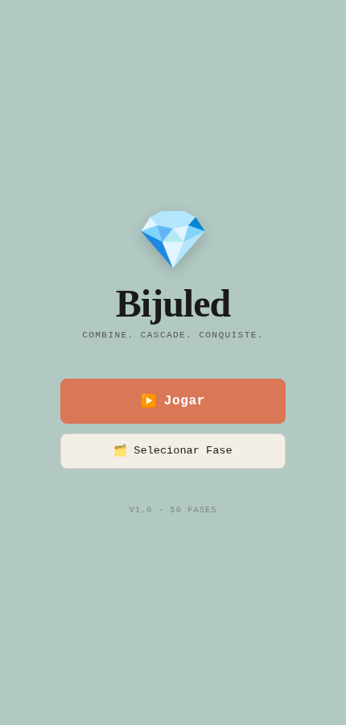
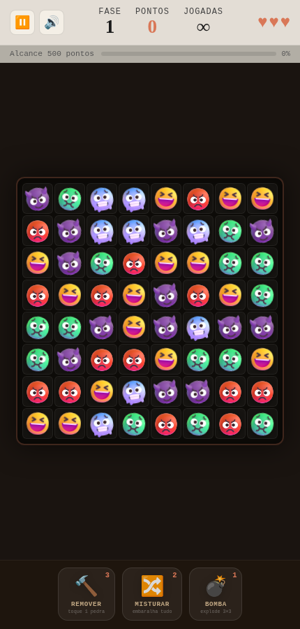
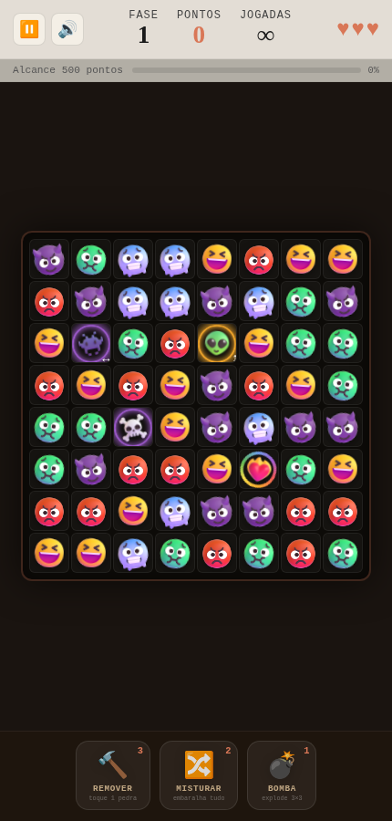

<div align="center">


# Bijuled

**Match-3 com Fluent Emojis — combine rostinhos, invoque criaturas e vença 50 fases.**

*Combine. Cascade. Conquiste.*

[Jogar agora](https://rfmss.github.io/bijuled/) · [Como jogar](#como-jogar) · [Instalar como app](#instalar-como-app)

</div>

---

| Menu | Jogo | Pedras especiais |
|:---:|:---:|:---:|
|  |  |  |

## Como jogar

Arraste (ou toque em duas peças vizinhas) para trocar rostinhos e formar linhas de 3 ou mais iguais. Matches somem, tudo desce em cascata, e cascatas multiplicam os pontos. Cada uma das **50 fases** tem um objetivo — pontuação, jogadas limitadas, tempo — e vale até 3 estrelas.

### As pedrinhas

| | Rostinho | |
|:---:|---|---|
| 😡 | **Raivinha** | vermelho |
| 🤢 | **Enjoadinho** | verde |
| 🥶 | **Congelado** | azul |
| 😆 | **Risadinha** | amarelo |
| 😈 | **Diabinho** | roxo |
| 👻 | **Fantasminha** | branco |

### As criaturas (combos de 4+)

Combine mais de 3 e uma criatura toma o lugar — a aura colorida mostra com qual cor ela ainda combina:

| Combo | Criatura | Efeito |
|---|:---:|---|
| 4 na linha | 👾 **Invader** | varre a linha inteira |
| 4 na coluna | 👽 **Alien** | raio abdutor limpa a coluna |
| Formato T ou L | ☠️ **Caveira** | explode uma área 3×3 |
| 5 seguidas | ❤️‍🔥 **Coração em chamas** | queima todas as pedras de uma cor |

### Boosts

- 🔨 **Remover** — destrói uma pedra à sua escolha
- 🔀 **Misturar** — embaralha o tabuleiro inteiro
- 💣 **Bomba** — explode uma área 3×3 onde você tocar

E ainda: rádio de fundo com MPB e clássicos internacionais 📻, elogios falados quando você manda bem 🎙️, e partículas por todo lado.

## Instalar como app

Bijuled é um **PWA**: abra [rfmss.github.io/bijuled](https://rfmss.github.io/bijuled/) no celular e use *"Adicionar à tela inicial"* (Chrome/Safari). O jogo funciona **100% offline** depois da primeira visita.

### Gerar o APK (Android)

O projeto está pronto para virar APK via [Bubblewrap](https://github.com/GoogleChromeLabs/bubblewrap) (Trusted Web Activity):

```bash
npm i -g @bubblewrap/cli
bubblewrap init --manifest https://rfmss.github.io/bijuled/manifest.webmanifest
bubblewrap build
```

O `bubblewrap build` gera `app-release-signed.apk` pronto pra instalar. Para remover a barra de URL, publique o SHA-256 da sua chave em `.well-known/assetlinks.json` (o Bubblewrap imprime o valor ao final do build).

## Rodar localmente

Sem build, sem dependências — é HTML/CSS/JS puro (ES5):

```bash
git clone https://github.com/rfmss/bijuled.git
cd bijuled
python3 -m http.server 8080
# abra http://localhost:8080
```

## Stack

- **Vanilla JS (ES5)** — roda até em iPad mini 2012 / iOS 9.3.5, sem framework, sem bundler
- **Engine match-3 própria** ([js/board.js](js/board.js)) — matches, cascatas, gravidade com células bloqueadas, detecção de T/L
- **Fluent Emoji 3D** da Microsoft como arte das peças, servidos localmente
- **PWA** — manifest + service worker cache-first, jogável offline

## Créditos & licenças

- Arte das peças: [Fluent Emoji](https://github.com/microsoft/fluentui-emoji) © Microsoft — licença MIT
- Rádio: streams públicos de MPB e clássicos internacionais
- Feito com 🧡 por [rfmss](https://github.com/rfmss)
